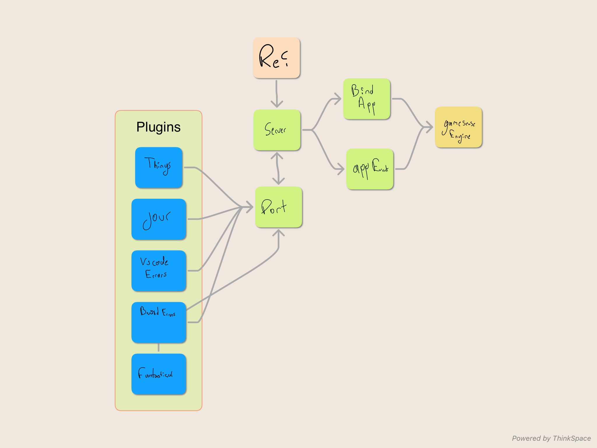

# rei
QCK Prism Cloth Javascript interface

# Description
## What
Rei is a javascript interface between the [Gamesense Engine](https://github.com/SteelSeries/gamesense-sdk/) and any other app through a server listening for notification messages.

## why
To control [QCK Prism Cloth XL](https://steelseries.com/gaming-mousepads/qck-prism-series) to receive external visual notifications from other apps

## GameSense notifications flow
The GameSense engine receives `POST` calls on the server port ([references on GameSense server and port](https://github.com/SteelSeries/gamesense-sdk/blob/master/doc/api/sending-game-events.md)).

Let's say we are going to bind a new game called `JOBSTATUS` with a `HEALTH` event to send `HEALTH` notifications to the `Prism Cloth`

- Bind Game event

    `POST 127.0.0.1:49494/bind_game_event`
    ```
    {
        "game": "JOBSTATUS",
        "event": "HEALTH",
        "min_value": 0,
        "max_value": 100,
        "handlers": [
            {
            "device-type": "indicator",
            "zone": "one",
            "color": {
                "red": 255,
                "green": 247,
                "blue": 0
            },
            "mode": "color"
            }
        ]
    }
    ```

- And then we are ready to send Game Events to the `JOBSTATUS` game
   
    `POST 127.0.0.1:49494/game_event`
    ```
    {
        "game": "JOBSTATUS",
        "event": "HEALTH",
        "data": {
            "value": 75
        }
    }
    ```

- Remember to send a heatbeat (color event last 15s)

    `POST 127.0.0.1:49494/game_heartbeat`
    ```
    {
        "game": "JOBSTATUS"
    }
    ```
# Mindmap


# Gamesense Engine  for the QCK
https://github.com/SteelSeries/gamesense-sdk/blob/master/doc/api/sending-game-events.md

## Register App/Game


## Register Event


## Send Event


# Roadmap